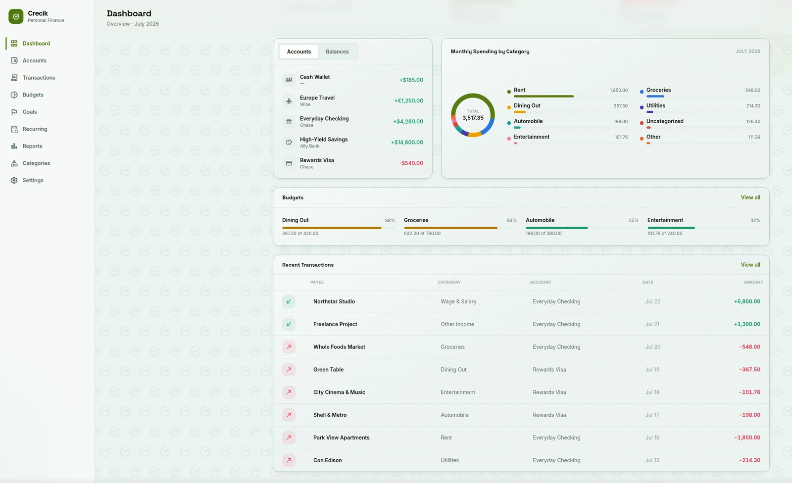

# coin-app

[](https://github.com/carlosnapolesdev/coin-app/actions/workflows/ci.yml)

Web client for **Crecik**, a personal finance management app: a public marketing landing (prerendered, SEO-ready), auth (password + Google Sign-In, email verification), a dashboard, multi-currency accounts, transactions (CSV import, receipts, tags), budgets, savings goals, recurring transactions, reports, and settings — with full dark/light theming and three languages (English, Spanish, Portuguese).

Talks to the [`coin-api`](https://github.com/carlosnapolesdev/coin-api) NestJS backend.



## Tech stack

- **Framework:** Vue 3.5 (`<script setup>` SFCs) + TypeScript
- **Build:** Vite 8, prerendered with `vite-ssg` (`vue-tsc` type-checks the production build)
- **Styling:** Tailwind CSS 3 with semantic color tokens — see [`DESIGN_SYSTEM.md`](./DESIGN_SYSTEM.md)
- **Routing:** vue-router 5 with auth guards
- **i18n:** vue-i18n 11 (`en`, `es`, `pt`)
- **HTTP:** axios with JWT bearer interceptor
- **Tests:** Vitest + jsdom

## Getting started

```bash
npm install
npm run dev
```

The dev server proxies `/api` to the backend at `http://localhost:8080`, so run `coin-api` first. To point the proxy elsewhere, set `VITE_API_PROXY_TARGET` in your shell before starting Vite.

## Scripts

| Script | Description |
|---|---|
| `npm run dev` | Dev server with HMR and `/api` proxy |
| `npm run build` | Type-check (`vue-tsc -b`) + production build to `dist/`, prerendering `/` via `vite-ssg` |
| `npm run preview` | Serve the production build locally |
| `npm run lint` | ESLint, zero warnings allowed |
| `npm test` | Run the Vitest suite once |
| `npm run fonts:subset` | Regenerate the Material Symbols icon-font subset |
| `npm run brand-assets` | Regenerate favicons/app icons from the source logo |

### Icon font

Icons come from a Material Symbols subset generated from `src/config/icons.ts`.
After changing `UI_ICONS` or `CATEGORY_ICONS`, regenerate it:

```bash
npm run fonts:subset
```

The full font lives in `fonts-src/` (build input, never served).

## Environment variables

| Variable | Default | Description |
|---|---|---|
| `VITE_API_BASE_URL` | `/api` | Base URL the axios client uses; set it when the API is not served from the same origin |
| `VITE_API_PROXY_TARGET` | `http://localhost:8080` | Dev-only: where Vite proxies `/api` (read from the shell environment) |

## Project structure

```
src/
├── components/
│   ├── dashboard/   # Feature views: Dashboard, Accounts, Transactions, Budgets,
│   │                # Goals, Recurring, Reports, Categories, Settings + modals
│   ├── landing/     # Sections of the public marketing landing (hero, features, how-it-works)
│   ├── legal/       # Privacy, terms, cookies, legal notice (shared LegalPage.vue)
│   ├── onboarding/  # Currency-selection welcome screen
│   ├── ui/          # Reusable component library (AppButton, AppModal, AppInput, …)
│   ├── common/      # TopHeader, UserMenu
│   └── *.vue        # Landing, auth screens (Login, Register, ForgotPassword, ResetPassword,
│                    # VerifyEmail, GoogleSignInButton), NotFound
├── composables/     # useTheme, useLocale, useCountUp
├── i18n/            # vue-i18n setup + en/es/pt locales
├── router/          # Routes, auth/currency guards, per-route <head> metadata
├── services/        # API modules (auth, accounts, transactions, budgets, goals, …)
└── utils/           # Formatting, currency, chart colors, initials
```

## Routing & auth

`/` serves a public, prerendered marketing landing; an already-authenticated visitor is redirected straight to the dashboard. `/login`, `/register`, `/forgot-password` and `/reset-password` are public-only (they redirect to the dashboard when already authenticated); every other route requires a session and redirects to `/login` (preserving the target as `?redirect=`). A session with `requiresCurrencySetup` is redirected to `/welcome/currency` instead. The JWT is attached to every request, and any `401` response clears the session.

## Design system

All UI work must follow [`DESIGN_SYSTEM.md`](./DESIGN_SYSTEM.md): semantic Tailwind tokens (never raw colors), the shared `src/components/ui` library, and dark mode as the primary theme. If a screen disagrees with that document, the screen is wrong.

## Testing

Unit tests are co-located with their source as `*.test.ts` (composables, i18n, services, utils) and run on Vitest with a jsdom environment:

```bash
npm test
```

## Docker & deployment

The multi-stage `Dockerfile` builds the static site (`node:22-alpine`) and serves it with `nginx:alpine`. It ships behind the same Caddy edge as `coin-api`, on the **same origin** as the API (`crecik.com` serves the app, `crecik.com/api/*` proxies to `coin-api`) — this is why the axios client defaults to the relative `/api` and no build-time API URL is normally needed.

- SPA fallback (`try_files $uri $uri/ /index.html`) with immutable caching for fingerprinted `/assets/*` and `no-cache` on `index.html`.
- Baseline security headers (`X-Content-Type-Options`, `X-Frame-Options`, `Referrer-Policy`, `Permissions-Policy`) applied to every response via an nginx snippet.
- `docker-compose.yml` publishes no ports; it only joins the external `web` network that Caddy reaches it on.

```bash
docker compose up -d --build
```

## License

MIT © Carlos Nápoles Avila
